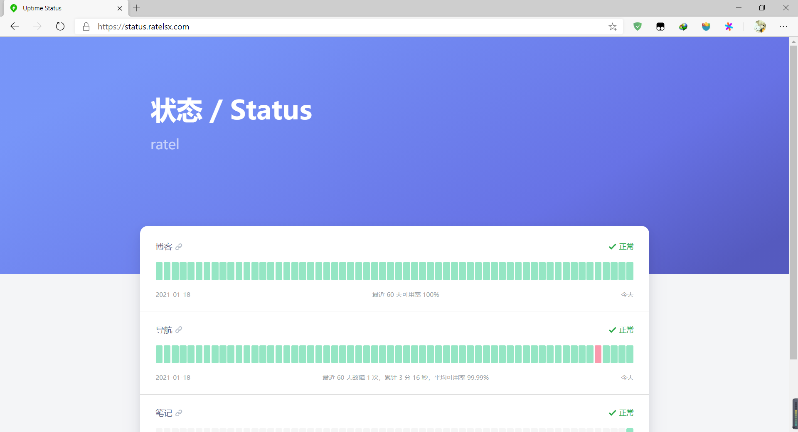
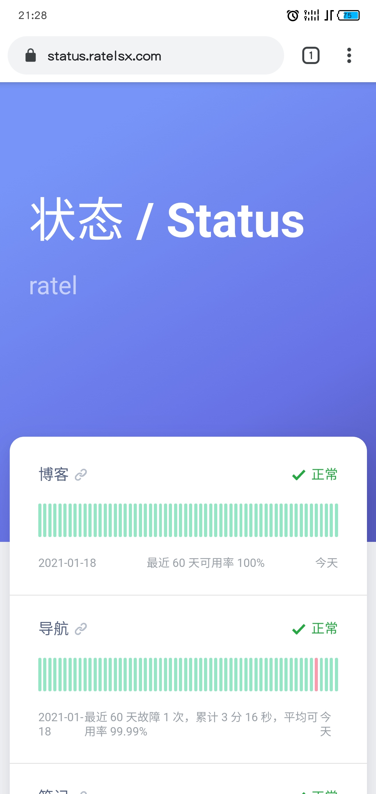

# uptime-status

一个基于 UptimeRobot API 的在线状态面板，源代码来自uptime-status，修改了布局排序以及样式


An uptime status dashboard based on UptimeRobot API

------

### 基于 Cloudflare Workers 搭建 UptimeRobot API 代理，以解决官网 API 跨域问题

Build an UptimeRobot API proxy based on **Cloudflare Workers** to solve the cross-domain issue of official API

```
const handleRequest = async ({ request }) => {
  let url = new URL(request.url);
  let response = await fetch('https://api.uptimerobot.com' + url.pathname, request);
  response = new Response(response.body, response);
  response.headers.set('Access-Control-Allow-Origin', '*');
  response.headers.set('Access-Control-Allow-Methods', '*');
  response.headers.set('Access-Control-Allow-Credentials', 'true');
  response.headers.set('Access-Control-Allow-Headers', 'Content-Type,Access-Token');
  response.headers.set('Access-Control-Expose-Headers', '*');
  return response;
}

addEventListener('fetch', (event) => {
  event.respondWith(handleRequest(event));
});
```

修改 `config.js` 中的 `ApiDomian` 为你的域名；

Modify `ApiDomian` in `config.js` to your domain;
> ## 原项目地址
> https://github.com/yb/uptime-status

基于yb大佬的uptime-status修改而来
## 样式来自
> https://solstice23.top/

## PC

## Android
